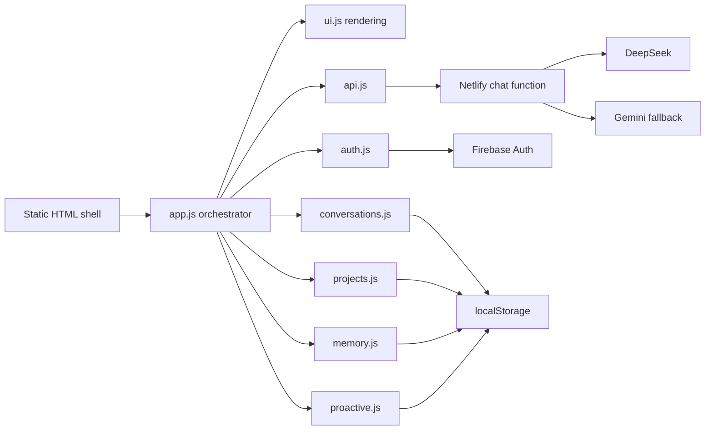

# Twinkle V2 product and engineering audit

Date: 2026-07-15  
Baseline: `f9b00a7` (`main`)

## Implementation status

Foundation slice completed locally on 2026-07-15:

- Model Markdown is escaped before formatting and unsafe link protocols are blocked.
- Markdown rendering now has its own pure, testable module.
- Semantic theme tokens support System, Light, Dark, and AMOLED preferences.
- Theme selection is stored per device without changing existing user-data keys.
- Focus-visible and reduced-motion foundations are active.
- The original authentication and product logic remain unchanged.

The adaptive application shell remains the next isolated migration slice.

### V3 adaptive workspace slice

Completed locally on 2026-07-15:

- Added a persistent desktop workspace rail and native-style mobile bottom navigation.
- Added connected Home, Projects, Memory, Tasks, Files, and Automation surfaces.
- Home uses only real local project, conversation, task, memory, and proactive data.
- Files and advanced automation are labelled honestly as future infrastructure rather
  than presented as working features.
- Chat retains its original controller, conversation storage, project context, and
  provider behavior inside the new adaptive shell.
- Added mobile context sheets and an optional desktop/tablet inspector.
- Verified responsive behavior at 390, 768, 1280, and 1920 px widths.

Reference imagery informed lighting, depth, editorial hierarchy, and native mobile
navigation. The layout, brand, content model, and components are original to Twinkle.

## Executive summary

Twinkle already has a useful product core: authenticated chat, provider fallback,
projects, conversations, memory, domain routing, proactive check-ins, news, and
local preferences. Those capabilities should be migrated, not rewritten.

The current constraint is the presentation architecture. A single 875-line app
controller owns routing, screen state, rendering, modal behavior, input behavior,
and most event registration. The interface has no responsive breakpoints, theme
model, command architecture, or focus-management primitive. Rendering relies on
large `innerHTML` replacements and reattaches listeners after each sidebar update.

Twinkle V2 should therefore use a strangler migration: introduce a new shell,
design system, state adapters, and feature controllers around the existing domain
modules, then migrate one surface at a time behind stable interfaces.

## What should be preserved

- Firebase authentication and token refresh behavior.
- Netlify Function boundary so provider credentials remain server-side.
- DeepSeek-primary and Gemini-fallback routing.
- Existing local-storage keys during migration to avoid user data loss.
- Conversation grouping, search, project association, and automatic titles.
- Domain detection and specialist system prompts.
- Proactive check-in scheduling, limits, quiet hours, and notifications.
- The dependency-light deployment model until a framework migration has a clear
  user or engineering benefit.

## Current architecture



The module split is directionally good, but the application controller and UI
renderer depend on globals and concrete DOM IDs. This makes layout changes risky
because state, behavior, and markup are coupled.

## Findings by severity

### Critical

1. **Model output is inserted as unsanitized HTML.** The Markdown parser transforms
   raw model text and writes it with `innerHTML`. Raw tags and dangerous link
   protocols can reach the page. The renderer must escape source text first or use
   a vetted Markdown parser plus an allow-list sanitizer.
2. **There is no responsive application layout.** Neither stylesheet contains a
   media query. The fixed 248 px sidebars consume 496 px before the chat column,
   making the authenticated interface structurally unsuitable for phones and
   narrow tablets.

### High

1. `app.js` owns auth screens, onboarding, boot animation, chat orchestration,
   navigation, projects, settings, proactive delivery, and phone UI.
2. The two stylesheets total more than 1,600 lines and duplicate modal, settings,
   toast, and component rules. Cascade order rather than ownership determines the
   final appearance.
3. Dialogs are generic `div` overlays without `role="dialog"`, `aria-modal`, focus
   trapping, focus restoration, or Escape handling.
4. Muted text uses `#555` on black, which does not meet normal-text contrast.
5. There is no `prefers-reduced-motion` path despite multiple infinite and entrance
   animations.
6. Full conversation and project arrays are parsed from local storage for most
   reads and writes, with no schema version adapter or quota recovery.
7. Chat history rerenders through `innerHTML` and binds a listener to every row on
   every update instead of using stable delegation.

### Medium

1. Streaming is simulated after the full provider response arrives. It increases
   perceived latency and repeatedly reparses the growing response.
2. Every simulated token replaces the complete message HTML, producing quadratic
   work on long responses and disrupting text selection.
3. Prompt, confirm, and title-only icon controls create inconsistent keyboard and
   screen-reader experiences.
4. Onboarding fields do not have programmatically associated labels.
5. Chat output has no live-region strategy for thinking, streaming, completion, or
   errors.
6. The shell exposes placeholder tools such as ADB without a capability model that
   distinguishes available, unavailable, and permission-gated actions.
7. News depends on a public RSS conversion service from the browser and has no
   abort, timeout, or privacy boundary.
8. The Firebase compat SDK and global IIFE modules prevent tree shaking and make
   dependency ownership implicit.
9. The original README is stale and describes client-side API keys that the
   recovered architecture no longer uses.

## UX and information architecture audit

The current shell treats chat, projects, tools, news, and statistics as equally
persistent panels. This creates visual density without establishing a primary
workflow. The right rail is especially expensive: placeholder tools and passive
statistics occupy permanent space while the conversation remains the main task.

Twinkle V2 should use three navigation layers:

1. **Global rail:** Home, Chats, Projects, Tasks, Memory, Files, Search, Settings.
2. **Context panel:** recent or pinned items for the selected global destination.
3. **Workspace:** the active conversation, project, task timeline, or memory view.

The contextual inspector should be optional and reserved for information about the
active object. News and usage statistics belong in Home, not beside every chat.

On mobile, global navigation becomes a five-item bottom bar. Context lists become
full-height sheets, while the composer remains anchored above the safe area.

## Twinkle V2 design-system direction

### Semantic color roles

Use semantic tokens instead of component colors:

- `--canvas`, `--surface-1`, `--surface-2`, `--surface-raised`
- `--text-1`, `--text-2`, `--text-3`, `--text-inverse`
- `--border-soft`, `--border-strong`, `--focus-ring`
- `--accent`, `--accent-hover`, `--accent-soft`
- `--positive`, `--warning`, `--danger`, `--info`

Themes should map those roles for Light, Dark, and AMOLED. Components must not
branch on theme names. A future dynamic accent changes only the accent token set.

### Type, spacing, and shape

- UI type: a variable sans with a native system fallback.
- Code type: a legible mono family with distinct punctuation.
- Base spacing: 4 px; primary rhythm: 8 px.
- Content measure: 44-52 rem for prose, wider only for tables and artifacts.
- Radii: 8, 12, 16, and 24 px; use pills only for compact status or filters.
- Shadows: two elevation recipes plus a focused accent glow; avoid shadow on every
  container.

### Motion

- 120-180 ms for direct manipulation and hover feedback.
- 220-320 ms for panels and page transitions.
- Animate opacity and transforms; avoid layout properties where possible.
- Reduced-motion mode removes parallax, spring overshoot, confetti, and simulated
  streaming delays.

## Target frontend architecture

```text
public/
  app/
    bootstrap.js
    router.js
    app-store.js
  core/
    events.js
    storage.js
    theme.js
    accessibility.js
  services/
    auth-service.js
    chat-service.js
    provider-client.js
    notification-service.js
  features/
    chat/
      chat-controller.js
      chat-view.js
      message-renderer.js
      composer.js
    conversations/
    projects/
    memory/
    tasks/
    files/
    settings/
    command-palette/
  components/
    dialog.js
    menu.js
    toast.js
    tooltip.js
    virtual-list.js
  styles/
    tokens.css
    themes.css
    reset.css
    shell.css
    components/
```

This can remain standards-based JavaScript initially. ES modules, small controllers,
and explicit dependency injection deliver most maintainability benefits without
forcing an immediate framework rewrite. A framework should be adopted only after
measuring whether complex interactive surfaces justify its runtime and migration
cost.

## State and storage strategy

- Introduce one storage adapter that reads the existing keys and writes versioned
  records.
- Keep auth state, durable domain data, and transient view state separate.
- Use an event/store boundary so views subscribe to scoped changes rather than
  rerendering entire lists.
- Add migrations before changing any stored shape.
- Add export/import before cloud sync so users retain data ownership.
- Treat cloud sync as a later capability with conflict resolution, encryption, and
  clear privacy controls.

## Feature-by-feature migration plan

### Phase 0: safety and observability

- Sanitize Markdown and validate outbound links.
- Add structured provider errors, request IDs, and client-safe diagnostics.
- Add storage schema validation and recovery tests.

Tradeoff: minimal visual change. Benefit: removes the largest security risk and
makes later failures diagnosable.

### Phase 1: design-system and adaptive shell

- Introduce semantic tokens and Light, Dark, and AMOLED themes.
- Build the global rail, contextual navigation, workspace, and optional inspector.
- Add mobile bottom navigation and sheet-based context panels.
- Add focus-visible and reduced-motion foundations.

Tradeoff: temporary coexistence with legacy component CSS. Performance impact is
small because this is CSS and a compact preference controller. It creates the
stable surface required by every later feature.

### Phase 2: world-class chat

- Replace the message renderer with sanitized semantic Markdown.
- Implement real provider streaming, cancellation, retry, regenerate, and copy.
- Preserve user scroll position and add long-thread windowing.
- Add accessible thinking, tool, completion, and error states.

Tradeoff: the Netlify provider contract changes. Use an adapter so old non-streaming
responses remain supported during rollout.

### Phase 3: navigation and command layer

- Add command palette, keyboard shortcuts, pinned chats, favorites, and recent
  activity.
- Use a central command registry shared by menus, buttons, and shortcuts.

Tradeoff: command metadata must be maintained, but it removes duplicate action
logic and makes future tools discoverable.

### Phase 4: projects, tasks, memory, and files

- Promote each capability to a dedicated workspace.
- Add project timelines, task states, memory provenance, and file previews.
- Keep AI context selection visible and editable.

Tradeoff: richer durable schemas require migrations and eventual sync decisions.
The separated feature controllers allow those changes without destabilizing chat.

### Phase 5: intelligence and personalization

- Add suggestion ranking, frequent-action shortcuts, layout preferences, and
  explainable proactive recommendations.
- Keep proactive behavior bounded by user-controlled schedules and clear history.

Tradeoff: personalization needs transparent controls and deletion. Recommendations
should remain local-first until a privacy model is chosen.

### Phase 6: performance hardening

- Virtualize large lists and long conversations.
- Lazy-load secondary workspaces and heavy renderers.
- Replace Firebase compat globals with modular imports if measurements justify it.
- Add performance budgets and automated accessibility checks.

## Verification gates for every slice

1. Existing storage fixtures load without data loss.
2. Authentication, provider fallback, chat send, conversation switching, and
   project context remain functional.
3. Keyboard-only completion of the changed workflow.
4. Screen-reader names, dialog focus, and live status are verified.
5. Layout is checked at 360, 768, 1280, 1440, and 1920 px widths.
6. Reduced motion and all three themes are checked.
7. Unit tests, JavaScript syntax checks, secret scan, and production build pass.
8. The slice has an explicit rollback boundary.

## Recommended first implementation slice

Start with **Phase 0 plus the smallest part of Phase 1**:

1. Safe Markdown rendering and link allow-listing.
2. Semantic design tokens with Dark as the compatibility default.
3. Theme preference controller for Light, Dark, AMOLED, and System.
4. Focus-visible and reduced-motion foundations.

This slice fixes a critical risk, introduces no storage-key changes, and establishes
the design API used by every later component. The adaptive application shell should
follow as its own slice after these foundations pass regression checks.
